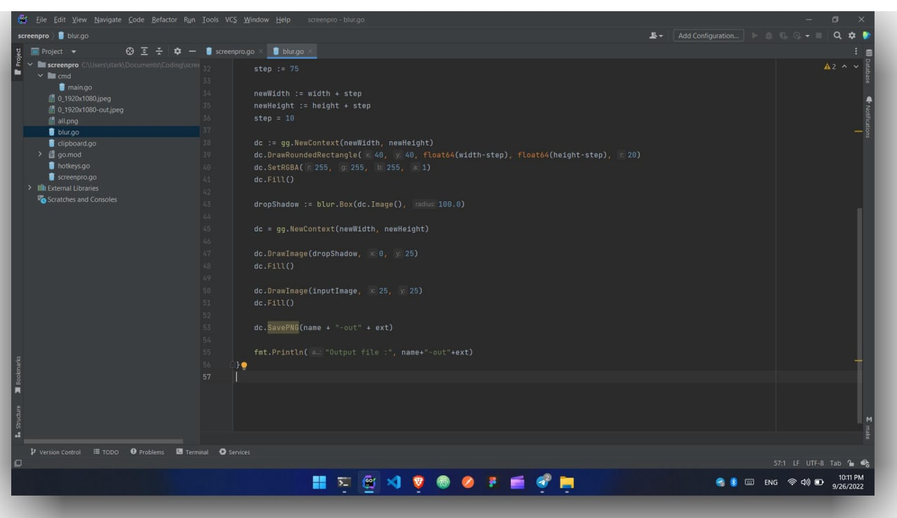

# ScreenPro

MacOS screenshot style on Windows.

# Work in progress
This project is working fine right now, but it still needs more improvements and to be maintained.
I'll be actively working on this project in my freetime. feel free to contribute :)

### Todo

1. [] "Blur()" function taks too long to process the image.
2. [] Save screenshot to clipboard.
3. [] Add more functionalities and improvements
4. [] Start the script in the background.

### Example screenshot
